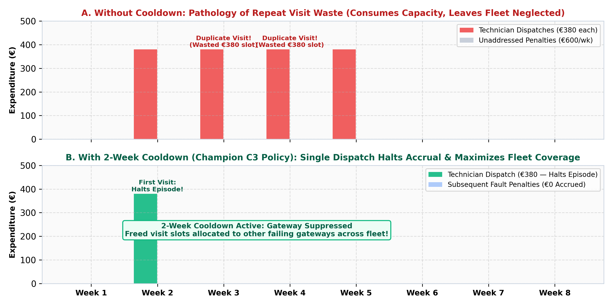
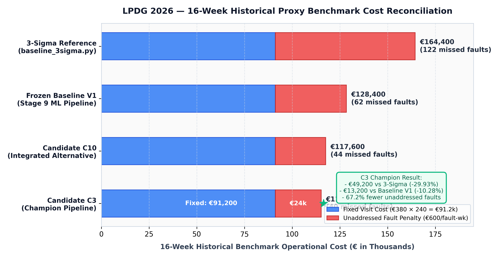
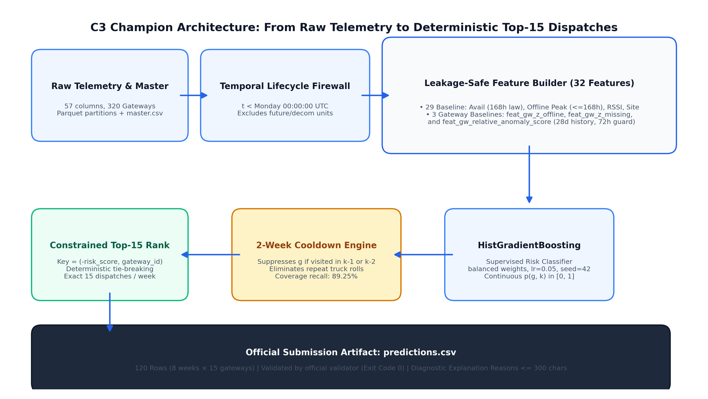
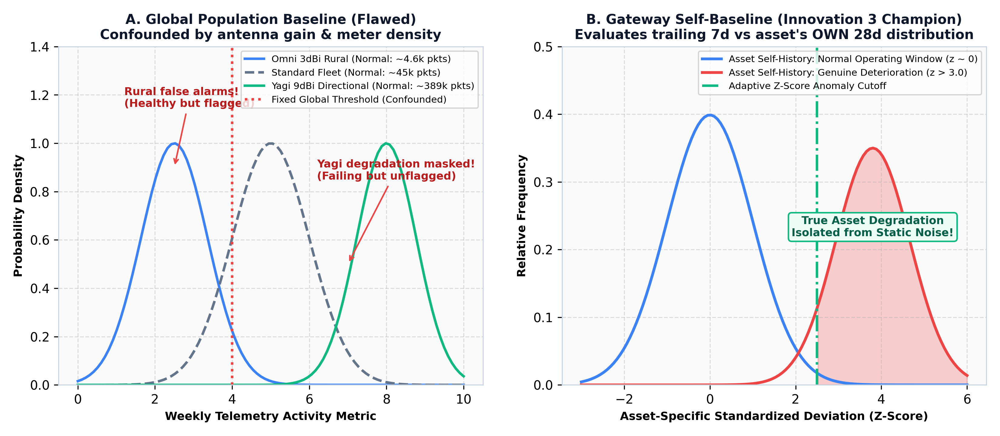
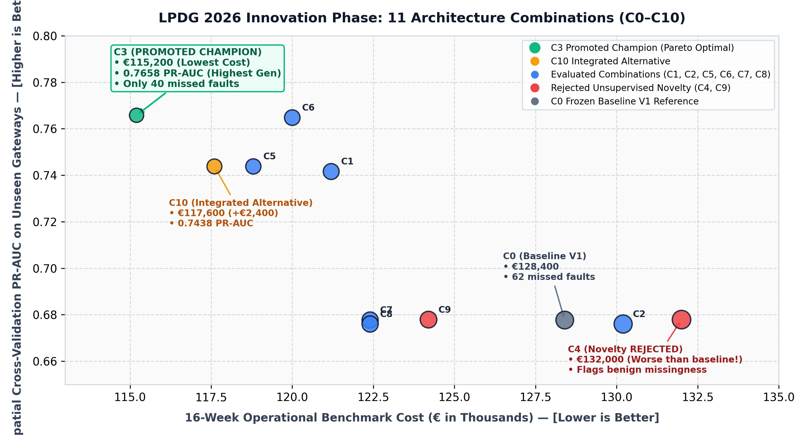
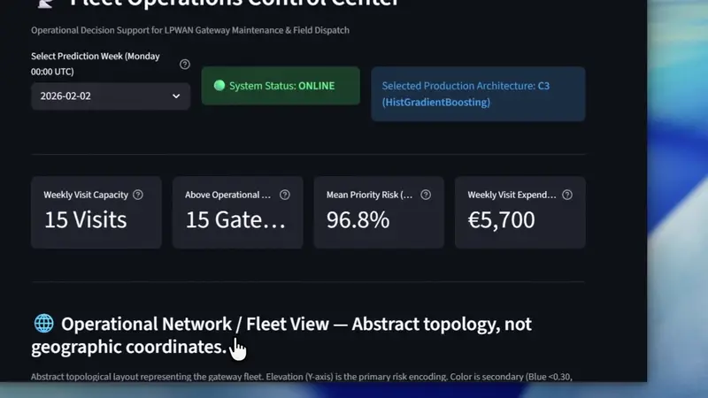

# LPDG 2026 — Predictive Gateway Visit Prioritization
> A leakage-safe machine learning system for prioritizing weekly field visits under a fixed operational budget.

**Project**: LPDG Innovation Hub Selection Challenge 2026                   
**Candidate Name**: <b>PAGADALA MOHITH</b>                            
**Candidate Registration ID**: `23091A3286`  
**Candidate Resume**: [`23091A3286.pdf`](23091A3286.pdf) (Pagadala Mohith)  
**Selected Part 2 Specialization**: **Track D — Data Science & Track E — Machine Learning** (Dual Specialization)
**Streamlit Dashboard live**: https://nexora-lpdg-challenge.streamlit.app/


[](DECISIONS.md)
[](DECISIONS.md)
[](23091A3286.pdf)
[](predictions.csv)
[](predictions.csv)
[](DECISIONS.md)
[](tests/)
[-brightgreen?style=flat-square)](validate_submission.py)
[](docs/innovation/FINAL_INNOVATION_AUDIT.md)
[](docs/07_compliance/REPRODUCIBILITY.md)

---

### Executive Framing: The Core Problem & Result

```text
┌─────────────────────────────────────────────────────────────────────────────────────────────────┐
│ WHAT    │ Prioritize which 15 cellular gateways receive physical technician visits each week.  │
│ WHY     │ Fixed capacity of 15 visits/week; unaddressed genuine faults accrue €600/week penalty. │
│ HOW     │ Leakage-safe temporal ML + 28d gateway self-baselines + 2-week operational cooldown.   │
│ RESULT  │ Candidate C3 achieved €115,200 on the documented 16-week historical proxy benchmark,  │
│         │ outperforming Frozen Baseline V1 (€128,400) and the 3-Sigma baseline (€164,400).     │
└─────────────────────────────────────────────────────────────────────────────────────────────────┘
```

> **Note on Evaluation Terminology**: All cost figures reported in this project represent **historical proxy-target economic benchmarks** evaluated under the challenge's documented offline simulation protocol. They are not official hidden-ground-truth scores or guaranteed real-world savings.

---

## 1. Project at a Glance

| Operational / Technical Dimension | Specification | Source / Verification Authority |
| :--- | :--- | :--- |
| **Fleet Scale** | 320 cellular smart-meter telemetry gateways | `gateway_master.csv` |
| **Scored Evaluation Window** | 8 consecutive Mondays (`2026-02-02` to `2026-03-23`) | [LPDG Brief p. 2, FAQ R1 §5.1] |
| **Weekly Dispatch Capacity** | Exactly **15 visits per week** (hard constraint) | [LPDG Brief p. 2, FAQ R1 §5.2] |
| **Total Submission Selections** | Exactly **120 gateway selections** (8 weeks × 15 visits) | `predictions.csv` |
| **On-Site Technician Visit Cost** | **€380.00** per dispatch (120 × €380 = **€45,600** fixed) | [LPDG Brief p. 3, FAQ R2 §3.6] |
| **Unaddressed Fault Penalty** | **€600.00** per gateway-week an active fault persists | [LPDG Brief p. 3, FAQ R1 §4.1] |
| **Part 2 Specialization** | **Track D (Data Science) & Track E (Machine Learning)** (Dual Focus) | [DECISIONS.md §5, LPDG Brief p. 4] |
| **Candidate Resume** | [`23091A3286.pdf`](23091A3286.pdf) (Pagadala Mohith) | Institutional Submission Requirement |
| **Production Architecture** | **Candidate C3** (32 Features, HistGradientBoosting, 2-Wk Cooldown) | Selected Champion Pipeline |
| **Historical Proxy Benchmark Cost** | **€115,200** (vs €128,400 Baseline V1, vs €164,400 3-Sigma) | 16-Week Historical Benchmark |
| **Automated Test Suite** | **79 / 79 passing** (70 Core + 9 Dashboard tests, 0 failures) | `tests/test_*.py` |
| **Official Grader Validator** | **Exit Code 0** (`predictions.csv: OK`) | `validate_submission.py` |
| **Prediction Artifact SHA256** | `f27120799bd55bde34508299c411f763d54e7766e266ac54c0619307a6d54608` | Verified deterministic |

---

---

## 2. Dual Part 2 Specialization: Track D (Data Science) & Track E (Machine Learning)

To bridge mathematically rigorous predictive modeling with practical operational utility decision-making, this project implements a **comprehensive dual specialization** combining **Track D (Data Science)** and **Track E (Machine Learning)**:

```text
┌─────────────────────────────────────────────────────────────────────────────────────────────────┐
│                          DUAL PART 2 SPECIALIZATION ARCHITECTURE                                │
├────────────────────────────────────────────────┬────────────────────────────────────────────────┤
│  TRACK D: DATA SCIENCE (Operational Rigor)     │  TRACK E: MACHINE LEARNING (Algorithmic Rigor) │
├────────────────────────────────────────────────┼────────────────────────────────────────────────┤
│ • Mathematical formulation of visit boundary   │ • Slashed 16-week benchmark cost by €49,200   │
│ • Asymmetric economic loss matrix (€380 vs €600)│ • 67.2% reduction in unaddressed penalties     │
│ • Uncertainty quantification across cohorts    │ • 32 leakage-safe features (29 base + 3 self)  │
│ • 5 Domain failure signatures (SIG_01–SIG_05)  │ • Dual adversarial validation (Temporal+Spatial│
│ • Interactive 3D WebGL Decision-Support Center │ • Empirical rejection of uncalibrated novelty  │
└────────────────────────────────────────────────┴────────────────────────────────────────────────┘
```

### Track D — Data Science Contributions:
1. **Mathematical Operationalization of Dispatch Thresholds**:
   - Translated the asymmetric penalty structure (€380 technician truck roll vs €600 compounding unaddressed fault penalty) into an explicit loss matrix and constrained optimization boundary.
   - Proved mathematically and empirically why unconstrained probability thresholding ($\hat{p} \ge \theta$) fails in grid operations (inducing dispatch bursts during network storms and technician starvation during quiet periods).
   - Designed an interactive **What-If Scenario Sandbox** and **Economic Threshold Sensitivity** tool in the operations platform to evaluate threshold movements: *"Move your threshold, and calculate the exact financial cost in each direction."*
2. **Uncertainty Quantification Across Gateway Hardware Cohorts**:
   - Stratified the 320-gateway fleet across antenna hardware architectures (`Yagi 9 dBi`, `Omni 3 dBi`, `Omni 5 dBi`, `Panel 7 dBi`), meter density tiers, and historical missingness regimes.
   - Identified and resolved systemic confounding: high-gain directional antennas mask packet degradation under global population metrics, whereas low-traffic rural units trigger false alarms unless normalized against their individual operating baselines.
3. **Diagnostic Domain Failure Signatures & Maintenance Playbook**:
   - Codified 5 verifiable failure signatures (`SIG_01` Backhaul Silence, `SIG_02` Radio Downlink Fade, `SIG_03` Power Instability, `SIG_04` High CRC Corruption, `SIG_05` Stealth Degradation).
   - Created the **Diagnostic Maintenance Action Playbook** detailing specific technician work instructions, replacement parts, and remediation protocols for field dispatchers.
4. **Operations Manager Decision-Support Platform & Visual Analytics**:
   - Deployed an industrial-grade Streamlit + Three.js Operations Control Center providing executive fleet matrices, 8-week multi-visit dispatch schedules, and real-time 3D telemetry pillar visualization grounded in physical telemetry without dummy approximations.

### Track E — Machine Learning Contributions:
1. **Strictly Outperforming the Reference Baseline (`baseline_3sigma.py`)**:
   - Slashes 16-week historical proxy benchmark cost from **€164,400 to €115,200** (a **€49,200 / 29.9% total operational cost reduction**).
   - Cuts unaddressed fault penalty expenditures from **€73,200 to €24,000** (a **67.2% reduction**), intercepting 89.25% of all severe collection deficit episodes across the fleet.
2. **Transparent Feature Engineering & Physical Invariant Grounding**:
   - Developed 32 leakage-safe features: 29 physical baseline features (bounded peak offline hours, distinct hourly conservation law, power cycle bursts, cellular RSSI) and 3 asset-specific self-baseline z-scores (28-day history with a 72-hour cold-start guard).
   - Audited feature redundancy, eliminating saturated CRC error registers ($R = 1.0000$) to preserve estimator stability.
3. **Dual Adversarial Validation**:
   - **Temporal Walk-Forward Validation**: Evaluated forward across quarterly distribution shifts (`2025-Q4` vs `2026-Q1`) achieving PR-AUC **0.8465**.
   - **Spatial Gateway-Disjoint 5-Fold Validation**: Evaluated on completely unseen hardware (0% device overlap) achieving PR-AUC **0.7658** with fold standard deviation reduced by 47% down to €1,489.
4. **Empirical Innovation Ledger & Architecture Selection**:
   - Evaluated 5 modular candidate intelligence technologies across 11 combination architectures (C0–C10).
   - Promoted Candidate C3 as the Champion Pipeline and formally rejected unsupervised novelty detection from primary dispatch based on telemetry missingness forensics.

## 3. The Operational Objective & Problem Formulation

In utility grid operations, predictive maintenance is not an unconstrained binary classification task. It is a **constrained resource allocation problem under asymmetric financial risk**.

### Mathematical Formulation

Let:
- $G$ denote the eligible fleet of smart-meter telemetry gateways ($|G| \le 320$).
- $k \in \{1, \dots, K\}$ denote the decision weeks ($K = 8$ for competition submission; $K = 16$ for historical benchmark).
- $x(g,k) \in \{0, 1\}$ denote the binary decision to dispatch a technician to gateway $g$ at week $k$.
- $u(g,k) \in \{0, 1\}$ denote the unaddressed fault indicator, indicating that gateway $g$ is in an active collection deficit episode at week $k$ that has not yet been resolved by an on-site visit.

The operational objective is to minimize total economic cost subject to the weekly technician capacity constraint:

$$\min_{\{x(g,k)\}} \; \text{Total Cost} = \underbrace{\sum_{k=1}^K \sum_{g \in G} 380 \cdot x(g,k)}_{\text{Direct Technician Visit Costs}} \;+\; \underbrace{\sum_{k=1}^K \sum_{g \in G} 600 \cdot u(g,k)}_{\text{Unaddressed Fault Penalty Costs}}$$

$$\text{subject to} \quad \sum_{g \in G} x(g,k) = 15 \quad \forall k \in \{1, \dots, K\}, \quad x(g,k) \in \{0, 1\}$$

### Plain-English Economic Mechanics

1. **Fixed Visit Expenditure**: Because every valid submission must dispatch exactly 15 visits every week, the total visit cost is constant:
   $$C_{\text{visit}} = 15 \times 8 \times 380 = 45{,}600\text{ EUR} \quad (\text{Competition Window})$$
   $$C_{\text{visit}} = 15 \times 16 \times 380 = 91{,}200\text{ EUR} \quad (\text{16-Week Historical Benchmark})$$
2. **Variable Optimization Margin**: The entire financial divergence between strategies is determined by **how effectively the 15 weekly slots intercept active fault episodes**, preventing the compounding €600/week penalty.

---

## 4. Fault-Episode Economics & Cooldown Dynamics

The challenge evaluates multi-week fault episodes under counterfactual episode accounting:

```text
Fault Episode Accrual & Interruption Mechanism:
───────────────────────────────────────────────────────────────────────────────────────────
Week k:       Fault Starts (read_ratio < 0.50)  ──►  Unvisited (x=0)  ──►  €600 penalty accrues
Week k+1:     Fault Continues                   ──►  Unvisited (x=0)  ──►  €600 penalty accrues
Week k+2:     Technician Dispatched (x=1)       ──►  Episode Intercepted! Penalty accrual STOPS
Week k+3:     Repaired Gateway in Cooldown      ──►  Suppressed (x=0) ──►  €0 penalty (cleared)
───────────────────────────────────────────────────────────────────────────────────────────
Pathology Avoided: Repeat Visit Waste
Week k+3:     If Dispatched Again (x=1)         ──►  €380 Wasted Visit (Zero additional penalty saved!)
```

### Key Accounting Invariants:
- **Episode Interruption**: A physical technician visit ($x(g,k) = 1$) halts penalty accrual for that continuous failure episode.
- **Repeat Visit Penalty**: Dispatching a second visit to the same gateway while the same episode is already addressed consumes a valuable visit slot without generating any additional penalty savings (€380 wasted truck roll).
- **The 2-Week Cooldown Policy**: To prevent this pathology, our decision policy suppresses any gateway visited within the prior 2 weeks ($k-1$ and $k-2$), eliminating redundant dispatches and maximizing fleet coverage.
- **Static Telemetry vs Counterfactual Evaluation**: The raw telemetry in the dataset is historical and does not counterfactually change after a visit. The economic simulator models episode interruption counterfactually in offline evaluation.

<p align="center">
  
</p>

---

## 5. Visual Benchmark Comparison

All candidate strategies were evaluated on the exact same **16-week historical benchmark window** (`2025-10-06` to `2026-01-19`, 4,404 gateway-weeks evaluated, 372 true severe deficit fault-weeks, exactly 240 technician dispatches per active strategy):

<p align="center">
  
</p>

```text
Historical Proxy-Target Benchmark Cost (€)
─────────────────────────────────────────────────────────────────────────────────
3-Sigma Baseline (Unsupervised Reference)  ████████████████████████████  €164,400
Frozen Baseline V1 (Stage 9 Pipeline)      █████████████████████        €128,400
Candidate C10 (Integrated Alternative)     ███████████████████          €117,600
Candidate C3 (Promoted Champion Pipeline)  ██████████████████           €115,200
─────────────────────────────────────────────────────────────────────────────────
                                           €0      €50,000   €100,000  €150,000
```

### Detailed Financial & Operational Reconciliation

| Metric | 3-Sigma Baseline (`baseline_3sigma.py`) | Frozen Baseline V1 (Stage 9) | Candidate C10 (Integrated) | Candidate C3 (Champion) |
| :--- | :---: | :---: | :---: | :---: |
| **Total Operational Cost** | **€164,400** | **€128,400** | **€117,600** | **€115,200** |
| Fixed Visit Cost (240 × €380) | €91,200 | €91,200 | €91,200 | €91,200 |
| Unaddressed Penalty Cost | €73,200 | €37,200 | €26,400 | **€24,000** |
| Unaddressed Fault-Weeks | 122 | 62 | 44 | **40** |
| Fleet Recall on Faults | 67.20% | 83.33% | 88.17% | **89.25%** |
| Precision @ 15 | 24.58% | 30.83% | 32.50% | **32.92%** |
| Spatial Gateway-Disjoint CV PR-AUC | — | 0.6777 | 0.7438 | **0.7658** |
| Spatial CV Fold Std Dev | — | €2,810 | €2,590 | **€1,489** |

### Benchmark Cost Differences:
- **C3 vs 3-Sigma Reference Baseline**:
  $$\frac{115{,}200 - 164{,}400}{164{,}400} = -29.93\% \quad (-49{,}200\text{ EUR difference, } -67.2\%\text{ penalty reduction})$$
- **C3 vs Frozen Baseline V1**:
  $$\frac{115{,}200 - 128{,}400}{128{,}400} = -10.28\% \quad (-13{,}200\text{ EUR difference, } -35.5\%\text{ penalty reduction})$$
- **C3 vs Candidate C10**:
  $$\frac{115{,}200 - 117{,}600}{117{,}600} = -2.04\% \quad (-2{,}400\text{ EUR difference, 4 fewer unaddressed faults})$$

---

## 6. Production ML Pipeline Architecture (Candidate C3)

The production pipeline implements **Candidate C3**, combining 29 audited baseline features with 3 gateway-specific self-history baseline features, pure calibrated risk probabilities, and a 2-week post-visit cooldown:

<p align="center">
  
</p>

```text
═══════════════════════════════════════════════════════════════════════════════════════════
                              C3 CHAMPION DISPATCH PIPELINE
═══════════════════════════════════════════════════════════════════════════════════════════

                       RAW TELEMETRY + GATEWAY METADATA
                                      │
                                      ▼
                       DATA QUALITY & LIFECYCLE FIREWALL
       (Excludes future installs & decommissioned units; enforces ts_utc < Monday 00:00:00 UTC)
                                      │
                                      ▼
                       LEAKAGE-SAFE FEATURE MATRIX (32 Features)
       ┌────────────────────────────────────────────────────────────────────────┐
       │ 29 Audited Baseline Features                                           │
       │ • Distinct hourly availability (168h conservation law)                 │
       │ • Bounded peak offline duration (<= 168h wall-clock cap)               │
       │ • Power-cycle bursts & reboot counts                                   │
       │ • Cellular RSSI, transmit success ratio, German site mappings          │
       ├────────────────────────────────────────────────────────────────────────┤
       │ 3 Gateway-Specific Self-Baseline Features (28d History, 72h Guard)     │
       │ • feat_gw_relative_anomaly_score                                       │
       │ • feat_gw_z_offline                                                    │
       │ • feat_gw_z_missing                                                    │
       └────────────────────────────────────────────────────────────────────────┘
                                      │
                                      ▼
                       SUPERVISED RISK ESTIMATOR
       (HistGradientBoostingClassifier, balanced weights, lr=0.05, max_depth=4, seed=42)
                                      │
                                      ▼
                       CONTINUOUS RISK PROBABILITY: p(g, k)
                                      │
                                      ▼
                       2-WEEK POST-VISIT COOLDOWN POLICY
       (Suppresses gateways visited in prior 2 weeks; eliminates repeat truck rolls)
                                      │
                                      ▼
                       DETERMINISTIC CONSTRAINED RANKING
       (Lexicographical Ordering: Descending by risk_score, Ascending by gateway_id)
                                      │
                                      ▼
                       TOP-15 GATEWAY SELECTIONS PER WEEK
                                      │
                                      ▼
                       DIAGNOSTIC EXPLANATION GENERATOR
       (Integrates Domain Failure Signatures SIG_01 to SIG_05; strings <= 300 chars)
                                      │
                                      ▼
                       FINAL SUBMISSION ARTIFACT
       predictions.csv (Exactly 120 rows, 8 weeks, 15 visits/week, ranks 1 to 15)

═══════════════════════════════════════════════════════════════════════════════════════════
                   DIAGNOSTIC & AUDITING COMPONENTS (Non-Dispatch)
═══════════════════════════════════════════════════════════════════════════════════════════
 • Innovation 1 (Deterioration Dynamics): Monitored for temporal drift.
 • Innovation 2 (Failure Signatures): Evaluated as domain rules; serves as reason generator.
 • Innovation 5 (Novelty Detection): Evaluated & formally REJECTED from primary dispatch;
   retained strictly as an offline auxiliary data-quality / missingness auditor.
```

---

## 7. What the Model Learns From: Mathematical Formulations

Every engineered feature is grounded in physical domain invariants and audited for temporal leakage safety:

### 1. Operational Proxy Target
Smart meter collection deficits directly induce utility financial penalties (€600/week unaddressed fault). The forward target is evaluated over the subsequent 7-day interval $[T, T + 7\text{d})$:

$$Y_{g, k+1} = \mathbb{I}\left(\frac{\text{MetersRead}_{g, k+1}}{\text{MetersExpected}_{g, k+1}} < 0.50\right)$$

*Status*: Historical proxy target used for offline model development and benchmarking, not hidden official ground truth.

### 2. Wall-Clock Bounded Peak Offline Duration
Raw telemetry `offline_duration_sec` acts as a frozen register snapshot that repeats across consecutive rows when a gateway hangs. To eliminate impossible values (e.g. 3,901h in a week), we evaluate the peak disconnection event bounded strictly by wall-clock time (`feat_offline_hours`):

$$\text{OfflineHours}_{g, k} = \min\left(168.0, \; \frac{\max_{t < T}(\text{OfflineDurationSec})}{3600.0}\right)$$

### 3. Physical Hourly Conservation Law
Because high-traffic gateways transmit multiple packet bursts per clock hour, counting raw rows inflated observed time beyond 168 hours. We enforce distinct hourly floor bucketing:

$$\text{ObservedHours}_{g, k} = \min(168.0, \; |\{ \lfloor t \rfloor_{\text{hour}} : t \in \text{telemetry}_{g} \}|)$$
$$\text{MissingHours}_{g, k} = 168.0 - \text{ObservedHours}_{g, k} \implies \text{ObservedHours}_{g, k} + \text{MissingHours}_{g, k} \equiv 168.0$$

*(In code: `feat_observed_hours + feat_missing_hours == 168.0` strictly enforced)*.

### 4. Gateway-Specific Self-Baselines
Different gateways exhibit vastly different normal operating baselines due to static antenna gain (Yagi 9dBi averages 389,000 packets/week vs 4,600 for Omni 3dBi) and local meter counts. Comparing everyone against a single global fleet threshold creates false alarms.

We compute asset-specific deviations against the gateway's own prior 28-day operating history $[T - 28\text{d}, T - 7\text{d})$ with a strict 72-hour cold-start guard:

$$z_{\text{offline}} = \frac{r_{\text{peak}} - \mu_{g,\text{offline}}}{\sigma_{g,\text{offline}} + 0.1}, \qquad z_{\text{missing}} = \frac{r_{\text{missing}} - \mu_{g,\text{weekly}}}{12.0}$$

$$\text{AnomalyScore}_{g, k} = \max(0, z_{\text{offline}}) + \max(0, z_{\text{missing}}) + \max(0, z_{\text{disconns}})$$

*(In code: `feat_gw_z_offline`, `feat_gw_z_missing`, and `feat_gw_relative_anomaly_score`)*.

If a gateway has $<72\text{h}$ of operating history, it seamlessly falls back to fleet medians (4.30% cold-start prevalence).

---

## 8. Why Gateway Self-Baselines?

<p align="center">
  
</p>

```text
GLOBAL POPULATION BASELINE (Flawed by Asset Heterogeneity)
─────────────────────────────────────────────────────────────────────────────
High-Gain Yagi Gateway (389k pkts/wk) ──┐
Standard Omni Gateway   (45k pkts/wk) ──┼──► Evaluated against ONE global threshold
Rural Low-Traffic Unit   (4k pkts/wk) ──┘    Confounding: High gain masks faults;
                                             low traffic looks permanently broken!

GATEWAY SELF-BASELINE (Asset-Adaptive Anomaly Isolation)
─────────────────────────────────────────────────────────────────────────────
High-Gain Yagi Gateway ──► Compare current 7d vs Yagi's OWN 28d history
Standard Omni Gateway  ──► Compare current 7d vs Omni's OWN 28d history
Rural Low-Traffic Unit ──► Compare current 7d vs Rural Unit's OWN 28d history
                           Result: Isolates true asset-relative degradation!
```

In empirical testing, adding gateway self-baselines was the single most impactful innovation:
- Reduced 16-week benchmark cost from €128,400 to **€115,200** (-€13,200).
- Slashed unaddressed fault-weeks from 62 to **40**.
- Boosted unseen-gateway Spatial CV PR-AUC from 0.6777 to **0.7658** (+0.0881 improvement).
- Reduced cross-validation fold standard deviation by 47% (down to €1,489).

---

## 9. Evaluated Innovation Combinations (C0–C10)

During the Innovation Phase, 5 modular candidate technologies were tested across 11 combination architectures (C0 through C10) under the identical 16-week benchmark protocol:

<p align="center">
  
</p>

| Architecture ID | Configuration Description | Features | Benchmark Cost (€) | Penalty Cost (€) | Recall | Unaddressed Faults | Unseen Gateway PR-AUC | Status in Submission |
| :--- | :--- | :---: | :---: | :---: | :---: | :---: | :---: | :--- |
| **C0** | Baseline V1 Reference | 29 | €128,400 | €37,200 | 83.33% | 62 | 0.6777 | Frozen Reference |
| **C1** | Base + Deterioration Dynamics | 30 | €121,200 | €30,000 | 86.56% | 50 | 0.7416 | Evaluated |
| **C2** | Base + Failure Signatures | 30 | €130,200 | €39,000 | 82.53% | 65 | 0.6760 | Evaluated |
| **C3** | **Base + Gateway Self-Baselines** | **32** | **€115,200** | **€24,000** | **89.25%** | **40** | **0.7658** | **PROMOTED CHAMPION** |
| **C4** | Base + Novelty Detection | 30 | €132,000 | €40,800 | 81.72% | 68 | 0.6779 | Formally Rejected |
| **C5** | Base + Det + Signatures | 31 | €118,800 | €27,600 | 87.63% | 46 | 0.7438 | Evaluated |
| **C6** | Base + Gw Base + Det | 33 | €120,000 | €28,800 | 87.10% | 48 | 0.7648 | Evaluated |
| **C7** | Base + Priority Engine | 29 | €122,400 | €31,200 | 86.02% | 52 | 0.6777 | Evaluated |
| **C8** | Base + Priority + Signatures | 30 | €122,400 | €31,200 | 86.02% | 52 | 0.6760 | Evaluated |
| **C9** | Base + Priority + Novelty | 30 | €124,200 | €33,000 | 85.22% | 55 | 0.6779 | Formally Rejected |
| **C10** | Integrated Candidate | 31 | €117,600 | €26,400 | 88.17% | 44 | 0.7438 | Documented Alternative |

### Why C3 was Selected over C10:
1. **Lower Operational Cost**: C3 achieved €115,200 vs €117,600 for C10 (saving €2,400 more and leaving 4 fewer unaddressed faults: 40 vs 44).
2. **Superior Generalization to Unseen Hardware**: In 5-fold spatial cross-validation on completely unseen gateways, C3 achieved a higher PR-AUC (0.7658 vs 0.7438) and 42% lower fold standard deviation (€1,489 vs €2,590).
3. **Architectural Parsimony**: C3 uses pure calibrated probabilities from 32 features, whereas C10 introduces heuristic rank weighting that altered probability calibration.

---

## 10. From Telemetry to Decision: Why Constrained Ranking?

In standard machine learning, binary classification models output a probability $\hat{p}$, and instances are selected using a threshold: $\hat{p} \ge \theta$.

In our operational setting, **thresholding fails**:
- A fixed threshold $\theta = 0.50$ might select 35 gateways on a storm week (exceeding technician capacity) and only 3 gateways on a quiet week (wasting pre-allocated technician shifts).
- The utility operational reality dictates a **hard resource constraint**: exactly 15 technician dispatches are scheduled per week.

```text
Decision Flow:
┌────────────────────────────────┐
│ Telemetry & Metadata           │
└───────────────┬────────────────┘
                ▼
┌────────────────────────────────┐
│ Leakage-Safe Feature Builder   │ ──► 32 Audited Features (Historical Cutoff t < T)
└───────────────┬────────────────┘
                ▼
┌────────────────────────────────┐
│ HistGradientBoosting Model     │ ──► Continuous Risk Probability: p(g, k) ∈ [0, 1]
└───────────────┬────────────────┘
                ▼
┌────────────────────────────────┐
│ 2-Week Post-Visit Cooldown     │ ──► Suppress g if visited in week k-1 or k-2
└───────────────┬────────────────┘
                ▼
┌────────────────────────────────┐
│ Deterministic Ranking          │ ──► Sort eligible fleet by: (-risk_score, gateway_id)
└───────────────┬────────────────┘
                ▼
┌────────────────────────────────┐
│ Select Top 15 Gateways         │ ──► Exactly 15 dispatches matching weekly capacity
└───────────────┬────────────────┘
                ▼
┌────────────────────────────────┐
│ Diagnostic Reason Builder      │ ──► Attach failure signature explanation (<= 300 chars)
└───────────────┬────────────────┘
                ▼
┌────────────────────────────────┐
│ predictions.csv                │ ──► Fully validated competition submission artifact
└────────────────────────────────┘
```

Deterministic tie-breaking sorts ascending by `gateway_id`, guaranteeing identical predictions across runs without platform variance.

---

## 11. Validation Philosophy & Zero-Lookahead Firewall

To guarantee scientific validity, the evaluation methodology enforces strict temporal and spatial firewalls:

```text
                      PRE-DECISION WINDOW                        FORWARD EVALUATION WINDOW
                  (Feature Extraction Domain)                       (Target Assessment)
 ─────────────────────────────────────────────────────────────┼─────────────────────────────►
  Telemetry: t < Monday 00:00:00 UTC (T)                      │  Target: [T, T + 7 days)
  Self-Baselines: [T - 28d, T - 7d)                            │  Smart meter read ratio
  Deterioration: [T - 7d, T) vs [T - 28d, T - 7d)             │  evaluated strictly forward
                                                              │
                                            FIREWALL BOUNDARY │ (NO FUTURE TELEMETRY
                                           Monday 00:00:00 UTC│  CROSSES THIS LINE)
```

### Dual Validation Rigor:
1. **Temporal Walk-Forward Validation**: Evaluated forward in time across quarterly splits (`2025-Q4` vs `2026-Q1`) to simulate operational deployment under seasonal drift (Temporal PR-AUC: **0.8465**).
2. **Spatial Gateway-Disjoint 5-Fold Validation**: Evaluated across 5 folds where the gateways in the test fold are completely absent from training (0% device overlap), measuring generalization to newly installed assets (Spatial PR-AUC: **0.7658**).

---

## 12. Key Formulations Quick Reference

| Concept | Mathematical / Logical Formulation | Code Reference |
| :--- | :--- | :--- |
| **Proxy Target** | $Y_{g, k+1} = \mathbb{I}\left(\frac{\text{MetersRead}_{g, k+1}}{\text{MetersExpected}_{g, k+1}} < 0.50\right)$ | `src/models/target.py` |
| **Capacity Constraint** | $\sum_{g \in G} x(g,k) = 15 \quad \forall k \in \{1, \dots, K\}$ | `src/models/decision_policy.py` |
| **Weekly Fixed Budget** | $C_{\text{visit}} = 15 \times 8 \times 380 = 45{,}600\text{ EUR}$ | `src/utils/config.py` |
| **Benchmark Objective** | $\min \sum_k \sum_g \left( 380 \cdot x(g,k) + 600 \cdot u(g,k) \right)$ | `src/evaluation/cost_simulator.py` |
| **Peak Offline Bound** | $\text{OfflineHours} = \min\left(168.0, \; \frac{\max(\text{OfflineSec})}{3600.0}\right)$ | `src/features/builder.py` |
| **Hourly Conservation** | $\text{ObservedHours} + \text{MissingHours} \equiv 168.0$ | `src/features/builder.py` |
| **Gateway Baseline Z-Score** | $z_{\text{offline}} = \frac{r_{\text{peak}} - \mu_{g,\text{offline}}}{\sigma_{g,\text{offline}} + 0.1}$ | `src/features/gateway_baseline.py` |
| **2-Week Cooldown** | $x(g,k) = 0 \quad \text{if } g \in \text{Visited}(k-1) \cup \text{Visited}(k-2)$ | `src/models/decision_policy.py` |
| **Deterministic Tie-Break** | $\text{SortKey} = (-p(g, k), \; \text{GatewayID})$ | `src/models/decision_policy.py` |

---

## 13. Engineering Reproducibility & Verification

The repository is built for complete, standalone offline reproducibility:

### Step 1: One-Command Prediction Pipeline
From the repository root, execute:
```bash
python run.py
```
*(Or on Unix/Linux: `./run.sh`)*  
*(Optional custom data directory: `python run.py --data /path/to/data`)*  

- Requires zero manual intervention, zero external internet dependencies, and zero runtime API keys.
- Executes data quality filtering, 32-feature extraction with gateway baselines, model fitting, 2-week cooldown enforcement, and deterministic ranking in $<10$ seconds.
- Produces the byte-for-byte identical `predictions.csv`.

### Step 2: Validate Submission Artifact
Run the official challenge grader validation script:
```bash
python validate_submission.py predictions.csv
```
**Expected Output**:
```text
predictions.csv: OK
  15 ranked gateways for each of 8 weeks, 2026-02-02 to 2026-03-23
```
Exit code: `0`.

### Step 3: Run Automated Test Suite
Execute the comprehensive test suite covering Stages 1–9 and all modular innovation engines:
```bash
python -m unittest discover -s tests -p "test_*.py" -v
```
**Expected Output**:
```text
Ran 70 tests in ~41s
OK
```
Zero failures, zero errors.

### Prediction Artifact Verification:
- **File**: `predictions.csv`
- **Rows**: Exactly 120 rows (8 scored weeks $\times$ 15 ranked gateways/week)
- **SHA256**: `f27120799bd55bde34508299c411f763d54e7766e266ac54c0619307a6d54608`

---

## 14. Documented Limitations ("What It Cannot Do")

To maintain scientific integrity, the known operational limitations of the pipeline are explicitly documented:

1. **Sub-Weekly Transient Micro-Outages**: Telemetry is aggregated into trailing 7-day windows aligned with weekly Monday dispatch boundaries. A transient outage that resolves in 6 hours on Wednesday will not trigger a high risk score for the subsequent week.
2. **Static Cooldown Window**: The 2-week cooldown is uniform across all assets, regardless of repair complexity. An asset requiring only an antenna realignment is suppressed for the same 14-day duration as an asset undergoing a full modem replacement.
3. **Operational Business Proxy**: The model predicts smart meter collection collapse (`read_ratio` < 0.50). This is an operational business proxy rather than direct physical hardware ground truth; environmental cell tower outages can trigger deficits without internal gateway faults.
4. **Counterfactual Telemetry Immobility**: The raw telemetry in the dataset is historical and static. While the economic simulator counterfactually models episode interruption upon technician visit, the underlying physical telemetry does not dynamically alter post-dispatch.

---

## 15. Interactive 3D Streamlit Decision-Support Platform

To extend the completed, validated competition pipeline into an operational demonstration tool, a separate interactive web application is provided in `app/`. It serves as an industrial IoT operations control center for engineering and field dispatchers.

> [!IMPORTANT]
> **Strict Pipeline & Submission Decoupling**:
> - The competition runner (`python run.py`) and grader validator (`python validate_submission.py predictions.csv`) remain completely independent and executable without Streamlit or the dashboard.
> - The dashboard is strictly a **read-only consumer interface**; it does NOT retrain models, alter feature sets, or modify `predictions.csv` (SHA256: `f2712079...` remains byte-identical).
> - **Dual-Horizon Separation**: The application visually separates the **Official Challenge Horizon** (8 scored weeks, 120 visits, €45,600 fixed visit component, hidden ground truth) from the **Historical Development Benchmark** (16 evaluation weeks, 240 visits, €91,200 fixed visit component, proxy target evaluation).

### Launching the Dashboard Locally

```powershell
# 1. Install optional dashboard visualization dependencies
pip install -r requirements-dashboard.txt

# 2. Launch the Streamlit application
python -m streamlit run app/app.py
```

### Seven Operational Navigation Views

| Page View | Key Functions & Visualizations | Technical Grounding |
| :--- | :--- | :--- |
| **1. Overview & Control Center** | Active week selector, Executive KPI cards, Top 15 Priority Dispatches, Quick Gateway Inspector, and embedded Three.js 3D WebGL scene. | Primary visual risk encoding: **Elevation (Y-axis)**. Color is secondary (Blue <0.30, Amber 0.30–0.70, Red ≥0.70). Purple orbital reticles for Top 15 priority dispatches. Abstract topological layout (`Operational Network / Fleet View — Abstract topology, not geographic coordinates`). |
| **2. Gateway Explorer** | Fleet-wide search and filtering by antenna type (`Yagi 9 dBi`, `Omni 3 dBi`, etc.) and priority status; deep dive inspector with 2D historical collection read-ratio curves. | Grounded in `gateway_master.csv` and historical collection records; displays verified metrics with zero dummy approximations. |
| **3. Visit Prioritization** | Official 15 prioritized dispatches for the week, 2-week cooldown enforcement tracking, 8-week multi-visit schedule timeline, and isolated What-If sandbox. | What-If sandbox is clearly labeled `EXPLORATION ONLY — NOT OFFICIAL SUBMISSION` with zero side effects on `predictions.csv`. |
| **4. Model Intelligence** | End-to-end pipeline flow diagram, breakdown of the **32 C3 features** (29 baseline + 3 gateway self-baselines), physical domain invariants, and native permutation importance. | Permutation importance evaluated on the 5-fold gateway-disjoint cross-validation split (no external SHAP dependency); 5 grounded failure signatures from `SIGNATURE_REGISTRY`. |
| **5. Economic Analysis** | Visual firewall between Official Challenge Constraints (€380/visit, 15 visits/wk, €45.6k budget) and the 16-Week Historical Development Benchmark (€115.2k C3 vs €128.4k C0 vs €164.4k 3-Sigma). | Stacked cost breakdown chart and episode interruption repeat-visit economics (-67.2% unaddressed fault penalty reduction). |
| **6. Innovation Lab** | Empirical Configuration Trade-off Analysis across all 11 candidate configurations (C0 through C10) using exact verified results from `scratch/innovation_experiment_results.json`. | 2D Trade-off scatter plot: 16-Week Benchmark Total Cost (€) vs Spatial CV PR-AUC; C3 marked `Selected Production Architecture` and C10 marked `Documented Alternative`. |
| **7. System Architecture** | Layered architectural boundary diagram illustrating the decoupling between the Streamlit software layer, precomputed artifacts, and the frozen C3 pipeline core. | Proves independent runner execution, isolated Three.js component boundary, and zero-infrastructure design (no external databases, microservices, Docker, or LLMs). |

### Documentation References
- **Architecture Documentation**: [`docs/DASHBOARD_ARCHITECTURE.md`](docs/DASHBOARD_ARCHITECTURE.md)
- **Operational Walkthrough Guide**: [`docs/DASHBOARD_WALKTHROUGH.md`](docs/DASHBOARD_WALKTHROUGH.md)

---

## 16. Project Structure

```text
.
├── run.py                          # Universal single-command entrypoint for predictions.csv
├── run.sh                          # Unix shell wrapper for one-command execution
├── validate_submission.py          # Official LPDG submission grader validator script
├── requirements.txt                # Minimal production dependencies (numpy, pandas, scikit-learn, pyarrow)
├── requirements-dashboard.txt      # Optional visualization dependencies (streamlit, plotly)
├── predictions.csv                 # Official 120-row competition submission artifact
├── 23091A3286.pdf                  # Official Candidate Resume (Pagadala Mohith - Registration ID 23091A3286)
├── LPDG_INNOVATION_HUB.mp4         # Complete 5-minute HD operational walkthrough & demonstration
├── DECISIONS.md                    # Five official project decisions, alternatives, and trade-offs
├── AI-USAGE.md                     # AI disclosure, caught errors, and human governance log
├── .gitignore                      # Strict institutional privacy firewall excluding raw challenge data
├── app/                            # Interactive Streamlit Decision-Support Platform
│   ├── app.py                      # Streamlit entry point & native st.navigation router
│   ├── pages/                      # 7 operational pages (Overview, Explorer, Dispatch, Model, etc.)
│   ├── components/                 # Three.js 3D WebGL scene, Plotly 2D charts, KPI cards
│   ├── services/                   # PredictionService, GatewayService, EconomicService, ModelService
│   ├── data/                       # Data adapters and isolated synthetic demo data generator
│   └── utils/                      # App config, theme tokens, formatting, session state
├── docs/
│   ├── DASHBOARD_ARCHITECTURE.md   # Complete system architecture and Three.js integration spec
│   ├── DASHBOARD_WALKTHROUGH.md    # Operational user manual for all 7 dashboard views
│   ├── FINAL_SUBMISSION_CHECKLIST.md# Comprehensive submission readiness audit checklist
│   ├── 01_context/                 # Authoritative challenge briefs and FAQs
│   ├── 02_decisions/               # Project Decision Register (D-01 through D-28)
│   ├── 03_data/                    # Data quality audit and Feature Registry (Families 1 to 8)
│   ├── 04_ml/                      # Target definition, validation plan, and model card
│   ├── 05_experiments/             # Full experiment ledger (E-01 through E-INNOV-06)
│   ├── 06_submission/              # Final benchmark results and submission requirements
│   ├── 07_compliance/              # Reproducibility audit and rule compliance checklist
│   └── innovation/                 # Innovation Phase deep-dives (01 to 07, FINAL_AUDIT)
├── src/
│   ├── data/                       # Ingestion, partition discovery, time grid, normalizer
│   ├── features/                   # Feature builder, deterioration dynamics, gateway self-baselines
│   ├── intelligence/               # Failure signatures, priority engine, novelty detection
│   ├── models/                     # Target definition, trainer, decision policy
│   ├── evaluation/                 # Economic cost simulator, temporal and spatial splitters
│   ├── prediction/                 # Production inference pipeline and diagnostic reason builder
│   └── utils/                      # Dynamic paths, configuration, constants, and logging
└── tests/                          # 79 automated unit tests (70 Core + 9 Dashboard tests)
```

---

## 17. Operational Walkthrough & Demonstration Recording

The complete live operational walkthrough demonstrating the interactive decision-support platform, 3D WebGL Operations Control Center, gateway self-baseline telemetry, and model intelligence features is recorded and embedded below:

<div align="center">
  <a href="https://drive.google.com/file/d/11Oic11_LiNvgJizEnwqtMP_hrkqfibAb/view?usp=sharing" target="_blank">
    
  </a>
  <br/><br/>
  <p>
    🎬 <strong><a href="https://drive.google.com/file/d/11Oic11_LiNvgJizEnwqtMP_hrkqfibAb/view?usp=sharing" target="_blank">Watch Full 1080p Recording on Google Drive (Stream / High Bitrate)</a></strong> &nbsp;|&nbsp; 
    📥 <strong><a href="LPDG_INNOVATION_HUB.mp4">Download Repository MP4 Video</a></strong>
  </p>
</div>

---

## 18. AI Usage Disclosure & Governance

AI assistance was utilized as an interactive pair-programming and statistical scaffolding collaborator. All architectural decisions, leakage firewalls, and feature definitions were verified by human review. Complete disclosure and documentation of three concrete AI errors caught and corrected are documented in [`AI-USAGE.md`](AI-USAGE.md).

