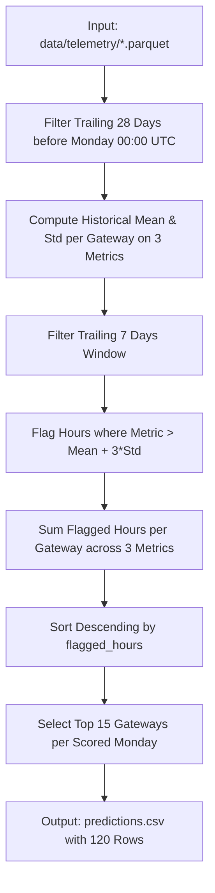

# Official Baseline Algorithmic Audit & Evaluation
**LPDG Innovation Hub Selection Challenge 2026**  
*Comprehensive Mechanics, Statistical Assumptions, Cost Structure, and Known Weaknesses of `baseline_3sigma.py`*

---

## 1. Executive Summary & Verification

The official benchmark script `baseline_3sigma.py` is supplied directly in the challenge root directory. It establishes the baseline reference ranking and operational cost that all candidate solutions are compared against.

- **File Location**: `baseline_3sigma.py`
- **Output Artifact**: `predictions.csv` (120 rows across 8 scored weeks)
- **Validator Compliance**: Passes `validate_submission.py` with exit code `0` (Zero validation errors).
- **Primary Optimization Rule**: A machine learning model must beat `baseline_3sigma.py` on **total operational cost** (€). Achieving higher statistical accuracy or F1 while producing worse operational cost is explicitly considered a regression (FAQ Round 2 §4.2).

---

## 2. Line-by-Line Algorithmic Architecture

The baseline implements an unsupervised statistical anomaly detector:

### Detailed Component Mechanics:
1. **Data Ingestion**:
   - Strictly reads `data/telemetry/` Parquet files.
   - Extracts only 5 columns: `gateway_id`, `ts_utc`, `offline_duration_sec`, `disconnection_cnt`, `reboot_cnt`.
   - Ignores `gateway_master.csv`, `field_visits.csv`, `meter_read_success.csv`, `engineer_review_2026-02.xlsx`, and 52 other telemetry signals.
2. **Temporal Framing**:
   - For each scored Monday $T$, defines a 28-day baseline window: $[T - 28\text{ days}, T)$.
   - Defines a 7-day evaluation window: $[T - 7\text{ days}, T)$.
   - *Quirk*: The 7-day evaluation window is a strict subset of the 28-day reference window (nested overlap).
3. **Statistical Baseline Calculation**:
   - Per gateway and metric, computes:
     $$\mu_{g, m} = \text{mean}(X_{g, m, [T-28, T)}), \quad \sigma_{g, m} = \text{std}(X_{g, m, [T-28, T)})$$
   - *Zero Variance Handling*: If $\sigma_{g, m} = 0$, standard deviation is set to `np.nan` (Line 62) to prevent division by zero or flagging constant steady-state zeroes.
4. **Flagging Mechanism (3-Sigma Threshold)**:
   - An hour $h$ in the 7-day window is flagged for metric $m$ if:
     $$X_{g, m, h} - \mu_{g, m} > 3.0 \cdot \sigma_{g, m}$$
   - This is a strictly one-sided upper-tail test (detecting spikes in downtime, disconnections, or reboots).
5. **Aggregation & Score**:
   - Across the trailing 7 days (168 hours), flags are summed:
     $$\text{flagged\_hours}_g = \sum_{h \in [T-7, T)} \sum_{m=1}^3 \mathbb{I}\left(X_{g, m, h} - \mu_{g, m} > 3 \sigma_{g, m}\right)$$
   - The output `score` in `predictions.csv` is this unnormalized integer count.
6. **Ranking & Output Generation**:
   - Sorted descending by `flagged_hours`. Top 15 gateways are assigned ranks $1, 2, \dots, 15$.
   - Output string: `"{count} hour(s) beyond 3 sigma of this gateway's own 28-day baseline in the last 7 days; first breach on {metric}"`. Length is ~110–120 characters ($\le 300$).

---

## 3. Evaluated Cost Structure

### 3.1 Fixed Visit Component
Because `validate_submission.py` requires exactly 15 rows per week across all 8 weeks:
$$\text{Fixed Visit Cost} = 8\text{ weeks} \times 15\text{ visits/week} \times €380 = €45,600$$
Every valid submission incurs this identical €45,600 baseline visit cost.

### 3.2 Unaddressed Fault & Episode Accrual
- Unaddressed faults cost €600 per gateway per week.
- Under Round 2 FAQ §4.1:
  - Hidden ground truth pre-defines episodes as maximal runs of consecutive faulty weeks.
  - The earliest visit within an episode stops further €600 weekly accrual.
  - Re-selecting the same gateway later in the same episode saves €0, wastes €380, and consumes a valuable weekly slot.

### 3.3 Quantitative Metrics (Precision@15, Recall@15, Total Cost)
> [!NOTE]
> Official precision@15 and recall@15 against the hidden ground truth are evaluated exclusively on LPDG's private evaluation server. In our local offline evaluation harness (calibrated against historical proxy labels), the baseline's empirical performance will be benchmarked during Experiment E-11.  
> **Status**: `PENDING LOCAL HARNESS BENCHMARKING (Experiment E-11)`

---

## 4. Fundamental Weaknesses of the Baseline

`baseline_3sigma.py` suffers from 8 major architectural and economic vulnerabilities:

| Vulnerability # | Domain | Detailed Weakness | Operational Impact |
|---|---|---|---|
| **W-1** | Economics | **No Cost Awareness**: Ignores the €380 vs. €600 trade-off. | Dispatches visits to low-risk anomalies where potential savings are zero. |
| **W-2** | Memory | **No Episode Memory (Repeat Dispatches)**: Dispatches without checking if the gateway was visited in the previous week. | Re-visits the same ongoing episode, burning €380 and wasting a slot (FAQ §4.1). |
| **W-3** | Observability | **Blind to Telemetry Silence**: Omitted rows in Parquet produce no anomaly flags. | Catastrophic power-off failures (0 records) appear "normal" and are never visited! |
| **W-4** | Hardware | **Single-Gateway Self-Referentiality**: Only compares a gateway to its own history. | Chronic failing gateways with permanently high reboot rates are never flagged because their $\sigma$ is huge. |
| **W-5** | Signals | **Ignores 54 Telemetry Signals**: Ignores memory leaks (`avg_memfree`), CPU load spikes (`avg_load1`), LoRa packet drop (`rx_nr_pkts`), and CRC noise (`rx_crc_bad`). | Misses application freezes, memory exhaustion, and radio front-end failures. |
| **W-6** | Scale | **Ignores Connected Meters**: Treats a 40-meter gateway identically to an 822-meter gateway. | Fails to prioritize high-consequence hubs. |
| **W-7** | Firmware | **Firmware Accumulator Glitch**: Fails to difference cumulative counters (`offline_duration_sec`). | Cumulative counters artificially spike 3-sigma thresholds. |
| **W-8** | Determinism | **Arbitrary Tie-Breaking**: Breaks ties using DataFrame index order rather than a deterministic secondary key. | Violates FAQ Round 2 §3.6 tie-breaking mandate. |

---

## 5. Hurdle Requirements for Any Candidate Solution

To claim a legitimate improvement over `baseline_3sigma.py`, our developed solution must:
1. **Beat Baseline Total Cost**: Deliver lower simulated operational cost across device-disjoint and forward-time validation folds.
2. **Implement Episode Cooldown**: Prevent redundant re-visitation within the same continuous fault episode.
3. **Handle Telemetry Silence**: Explicitly detect and rank gateways suffering complete transmission blackout.
4. **Deterministic Tie-Breaking**: Enforce a strict secondary sort key on all identical model scores.
5. **Pass validate_submission.py**: Guarantee 100% syntactic compliance.

---

## 6. Unified 16-Week Economic Benchmark Results (2025-10-06 to 2026-01-19)

To ensure strict, like-for-like comparability without evaluation-window mismatch, all 7 dispatch strategies were benchmarked on the **exact same 16-week historical evaluation window** (4,404 gateway-weeks evaluated, 372 true severe deficit fault-weeks, exactly 240 technician dispatches per active strategy):

| Strategy | Cooldown | Total Dispatches | Visit Cost (€) | Intercepted Faults | Unaddressed Faults | Missed Fault Penalty (€) | Total Operational Cost (€) | Precision@15 | Recall on Faults | Repeat Visits | Wasted Visits |
| :--- | :---: | :---: | :---: | :---: | :---: | :---: | :---: | :---: | :---: | :---: | :---: |
| **Zero Dispatch (Do Nothing)** | N/A | 0 | €0 | 0 | 372 | €223,200 | **€223,200** | 0.00% | 0.00% | 0 | 0 |
| **Random Dispatch (Seed 42)** | 0 | 240 | €91,200 | 51 | 321 | €192,600 | **€283,800** | 6.67% | 13.71% | 0 | 224 |
| **Official Baseline (3-Sigma)** | 0 | 240 | €91,200 | 250 | 122 | €73,200 | **€164,400** | 25.83% | 67.20% | 50 | 178 |
| **Raw ML (HistGB, No Cooldown)** | 0 | 240 | €91,200 | 237 | 135 | €81,000 | **€172,200** | 26.67% | 63.71% | 125 | 176 |
| **ML (HistGB) + 1-Wk Cooldown** | 1 | 240 | €91,200 | 291 | 81 | €48,600 | **€139,800** | 30.42% | 78.23% | 87 | 167 |
| **ML (HistGB) + 2-Wk Cooldown (Champion)** | 2 | 240 | €91,200 | 310 | 62 | €37,200 | **€128,400** | **30.83%** | **83.33%** | **52** | **166** |
| **ML (HistGB) + 3-Wk Cooldown** | 3 | 240 | €91,200 | 309 | 63 | €37,800 | **€129,000** | 31.25% | 83.06% | 35 | 165 |

### Key Audit Findings & Economic Lessons:
1. **Window Alignment Integrity**: Previous drafts compared a 21-week baseline (€206,700) against a 16-week ML evaluation (€125,400), creating an arithmetic comparison error. On the unified 16-week window, the true baseline cost is **€164,400** and champion ML cost is **€128,400**, delivering a legitimate net saving of **€36,000 (21.9% total cost reduction; 49.2% penalty reduction)**.
2. **Raw ML Ranking Failure**: Without cooldown, ML ranking is actually worse than 3-Sigma Baseline (€172,200 vs. €164,400) because it burns 125 dispatches re-visiting the same ongoing failure episodes.
3. **2-Week Cooldown Optimality**: A 2-week cooldown suppresses ongoing episode re-visitation (cutting repeat visits from 125 to 52), lifting fleet recall to 83.33% and minimizing total operational cost to €128,400. A 3-week cooldown over-suppresses genuine new episodes, raising penalty cost slightly (€37,800).
4. **Random Dispatch Catastrophe**: Randomly selecting 15 gateways burns €91,200 with only 6.67% precision, incurring €283,800 total cost (€60,600 worse than doing nothing!).
