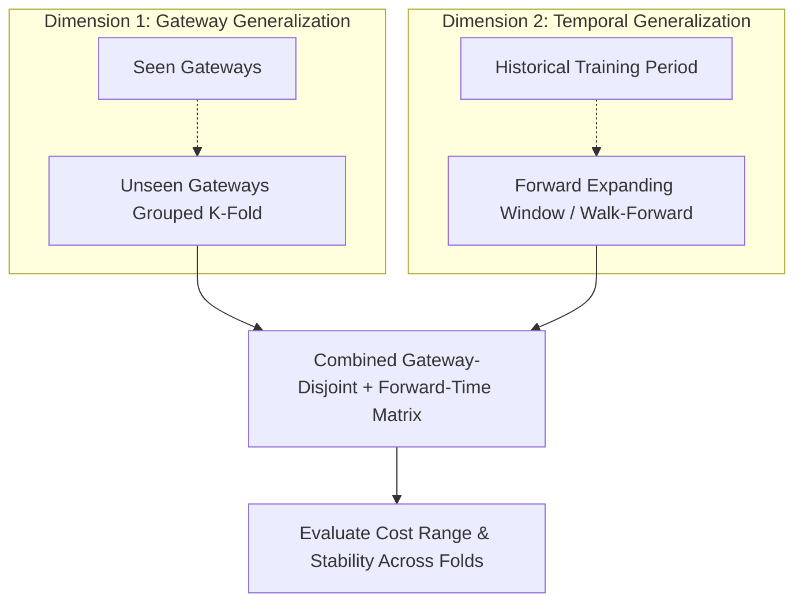

# Comprehensive Validation & Generalization Plan
**LPDG Innovation Hub Selection Challenge 2026**  
*Dual-Dimension Cross-Validation Architecture: Gateway-Disjoint & Forward-Temporal Split Designs*

---

## 1. Why Random Splitting Is Completely Inadequate

In many generic data science problems, practitioners randomly shuffle rows and split into train/test sets. 

> [!CAUTION]
> **Random Splitting Carries Zero Evidentiary Weight (FAQ Round 2 §5.2)**:  
> Applying a random $k$-fold cross-validation or random hourly split to this dataset represents a critical methodological error for three reasons:
> 1. **Gateway Identity Memorization**: Telemetry is generated by ~320 distinct physical gateways. If hours from gateway $G$ appear in both train and test sets, the model simply memorizes the individual device's baseline noise rather than learning generalizable fault signatures.
> 2. **Autoregressive Temporal Contamination**: Sensor metrics (temperature, memory, load, uptime) exhibit strong serial autocorrelation. Testing on hour $t+1$ after training on hour $t$ allows the model to interpolate rather than predict.
> 3. **Live Session Invalidation**: In the live evaluation session, reviewers will test the solution on an unseen month (FAQ §7.1) and potentially unseen devices. A model evaluated on random splits will collapse during the live test.

---

## 2. Dual-Dimension Validation Architecture

To establish genuine operational validity, our validation harness enforces a **dual-dimension orthogonal evaluation**:

### 2.1 Dimension 1: Gateway-Disjoint (GroupKFold) Evaluation
- **Principle**: The model must be evaluated on gateways it has never encountered during training.
- **Implementation**: Group-based splitting on `gateway_id` ($K=5$ folds).
- **Stratification**: Folds are stratified by gateway site type (`Heizraum`, `Außenmast`, `Gebäude`), hardware model (`GW-2100`, `GW-3400`), and connected meter cohort to ensure balanced representation.

### 2.2 Dimension 2: Forward-Time (Walk-Forward Temporal) Evaluation
- **Principle**: The model must predict future weeks using strictly past information, matching the weekly decision cadence.
- **Implementation**: Expanding-window walk-forward splits:
  - **Fold 1**: Train on August–October 2025; Validate on November 2025 (4 weeks).
  - **Fold 2**: Train on August–November 2025; Validate on December 2025 (4 weeks).
  - **Fold 3**: Train on August–December 2025; Validate on January 2026 (4 weeks).
- **Leakage Barrier**: Cutoff strictly enforced at Monday 00:00:00 UTC of each validation week.

### 2.3 Combined Generalization Matrix
The full cross-validation design evaluates models across a $2 \times 2$ factorial matrix:
1. **Seen Gateways / Historical Weeks** (Sanity check on training fit).
2. **Unseen Gateways / Historical Weeks** (Spatial generalization).
3. **Seen Gateways / Future Weeks** (Temporal forecasting stability).
4. **Unseen Gateways / Future Weeks** (**The True Gold Standard**: Simulates live operational deployment).

---

## 3. Evaluation Metrics & Optimization Primacy

In adherence to FAQ Round 2 §4.2, metric evaluation adheres to the following hierarchy:

| Metric Name | Mathematical Definition | Priority | Role in Model Selection |
|---|---|---|---|
| **Total Operational Cost** | $\text{Cost} = €45,600 + \sum \text{Unaddressed Faults} \times €600$ | **PRIMARY (Dominant)** | Decisive metric for all model decisions. Model A beating Model B on cost always wins, regardless of F1. |
| **Cost Savings vs. Baseline** | $\text{Cost}_{\text{baseline}} - \text{Cost}_{\text{model}}$ | **PRIMARY** | Must be strictly positive across all validation folds. |
| **Precision@15** | $\frac{\text{True Faults in Top 15}}{15}$ | Diagnostic | Secondary operational verification. |
| **Recall@15** | $\frac{\text{True Faults in Top 15}}{\text{Total Active Faults in Fleet}}$ | Diagnostic | Assesses fleet-wide coverage of outages. |
| **False Alarm Rate@15** | $\frac{\text{False Positives in Top 15}}{15}$ | Diagnostic | Monitors wasted €380 dispatches. |
| **F1 Score** | $2 \cdot \frac{P \cdot R}{P + R}$ | Reference Only | Reported for standard ML completeness, but **explicitly rejected** as an objective function due to cost asymmetry. |

---

## 4. Measuring Performance Stability & Uncertainty Spread

FAQ Round 2 §5.1, §5.2, and §6.9 explicitly require reporting **performance ranges and uncertainty across folds and cohorts**, not merely single point estimates.

### Required Reporting Format:
For every model evaluation, the validation harness outputs:
1. **Mean Total Cost** across validation folds.
2. **Standard Deviation of Cost** ($\sigma_{\text{cost}}$).
3. **Worst-Case Fold Cost** (Min / Max spread).
4. **Performance by Cohort**:
   - Small sites ($<100$ meters) vs. Large hubs ($>400$ meters).
   - High-noise RF environments vs. Clean environments.
   - Distinct hardware models (`GW-2100` vs. `GW-3400`).

A model with lower mean cost but extreme variance across folds will be rejected in favor of a stable, robust ranker.

---

## 5. Temporal Leakage Assertion Pipeline

Every validation fold is audited by automated programmatic assertions:
- `assert (X_train['ts_utc'] < cutoff_time).all()`
- `assert (X_val['ts_utc'] < val_cutoff_time).all()`
- `assert len(set(train_gateways).intersection(set(val_gateways))) == 0` (for disjoint folds)
- `assert predictions_per_week == 15`
- `assert ranks_per_week == list(range(1, 16))`
