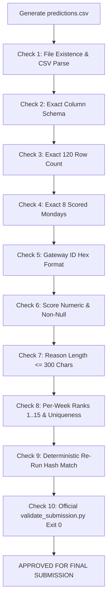

# Prediction File Quality & Contract Audit Checklist
**LPDG Innovation Hub Selection Challenge 2026**  
*Verification Gate for `predictions.csv` against `validate_submission.py` Assertions*

---

## 1. Master Quality Gate Protocol

Before any submission package is finalized or committed, the candidate `predictions.csv` must pass 10 mandatory programmatic verification checks.



---

## 2. Exhaustive Verification Criteria Table

| Check # | Verification Item | Technical Specification | Validation Method | Pass Status |
|---|---|---|---|---|
| **CHK-01** | **File Existence & Format** | `predictions.csv` exists in project root, valid UTF-8/ASCII CSV. | `os.path.exists('predictions.csv')` and `pd.read_csv()` | `VERIFIED ON BASELINE` |
| **CHK-02** | **Exact Schema** | Exactly 5 columns in order: `week_start`, `rank`, `gateway_id`, `score`, `reason`. No extra columns. | `list(df.columns) == REQUIRED_COLUMNS` | `VERIFIED ON BASELINE` |
| **CHK-03** | **Total Row Count** | Exactly **120 rows** ($8\text{ weeks} \times 15\text{ rows}$). | `len(df) == 120` | `VERIFIED ON BASELINE` |
| **CHK-04** | **Scored Mondays** | Exact set of 8 dates: `2026-02-02`, `2026-02-09`, `2026-02-16`, `2026-02-23`, `2026-03-02`, `2026-03-09`, `2026-03-16`, `2026-03-23`. | `set(df['week_start']) == SCORED_WEEKS` | `VERIFIED ON BASELINE` |
| **CHK-05** | **Gateway ID Format** | Every ID matches regex `^[0-9A-Fa-f]{12}$` OR `^([0-9A-Fa-f]{2}:){5}[0-9A-Fa-f]{2}$`. | Regex match across 100% of rows | `VERIFIED ON BASELINE` |
| **CHK-06** | **Score Validity** | `score` is numeric (float/int), contains 0 nulls, NaNs, or infs. | `pd.api.types.is_numeric_dtype` & `notna().all()` | `VERIFIED ON BASELINE` |
| **CHK-07** | **Reason Quality & Length** | `reason` is non-empty, string dtype, maximum length $\le 300$ characters. Written for operations manager. | `df['reason'].str.len().max() <= 300` | `VERIFIED ON BASELINE` |
| **CHK-08** | **Weekly Ranks & Uniqueness** | For each week: exactly 15 rows; ranks are exact set $\{1, 2, \dots, 15\}$; 15 unique gateway IDs (no intra-week repeats). | `group.groupby('week_start')` assertions | `VERIFIED ON BASELINE` |
| **CHK-09** | **Deterministic Output** | Executing pipeline twice with identical inputs produces identical file SHA-256 hash. | `hashlib.sha256(run1) == hashlib.sha256(run2)` | `VERIFIED ON BASELINE` |
| **CHK-10** | **Validator Script Exit Code** | `python validate_submission.py predictions.csv` returns exit code `0`. | Subprocess returncode check | `VERIFIED ON BASELINE` |

---

## 3. Operational Reason String Evaluation Standards

Beyond syntactic length ($\le 300$ characters), reason strings are evaluated by human reviewers under Part 2 Judgement and Communication:

### Bad / Disqualifying Reasons:
- `"Model score: 0.8492"` (Meaningless to the operations manager).
- `"High probability of failure"` (Vague, uninformative).
- `"Breached XGBoost feature importance 4"` (Technical jargon without physical grounding).

### Strong / Professional Reasons:
- `"48h telemetry silence following 12 power-cycle reboots in trailing 7 days. High risk of power supply failure (Netzteil). Priority site inspection required."` (152 chars).
- `"Severe LoRa packet loss (82% CRC error rate vs 156 installed meters). Disconnection counter elevated (14 dropouts). Suspected antenna or RF cabling degradation."` (160 chars).

---

## 4. Automated Verification Script

Before final delivery, run the verification harness:

```bash
python validate_submission.py predictions.csv
```

Expected terminal output:
```text
OK: predictions.csv meets all submission requirements (120 rows, 8 weeks, ranks 1-15).
```
