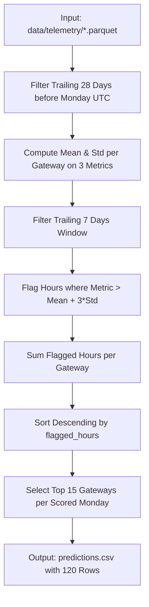

# Line-by-Line Algorithmic Audit: `baseline_3sigma.py`
**LPDG Innovation Hub Selection Challenge 2026**  
*Mechanics, Statistical Assumptions, Quirks, and Limitations of the Official Baseline*

---

## Section 1: Algorithmic Architecture & Execution Flow



### Detailed Breakdown of the 12 Core Architectural Aspects

#### 1. What Data It Reads
`baseline_3sigma.py` loads strictly from `data/telemetry` (Parquet) and extracts exactly 5 columns:
- `gateway_id`
- `ts_utc` (converted to UTC timestamp `ts`)
- Three telemetry metrics: `offline_duration_sec`, `disconnection_cnt`, `reboot_cnt`.
It completely ignores `gateway_master.csv`, `field_visits.csv`, `meter_read_success.csv`, `engineer_review_2026-02.xlsx`, and 52 other telemetry columns.

#### 2. What Three Metrics It Uses
1. `offline_duration_sec`: Duration spent offline during the hour (seconds).
2. `disconnection_cnt`: Frequency of backhaul dropouts during the hour.
3. `reboot_cnt`: Count of gateway restart cycles during the hour.

#### 3. What the 28-Day Window Means
For each scored Monday $T$, it defines a baseline reference window $[T - 28\text{ days}, T)$. This historical window establishes the individual gateway's normal operating distribution.

#### 4. What the 7-Day Window Means
The evaluation window is the immediate trailing week $[T - 7\text{ days}, T)$. The script tests whether the gateway's behavior during the past 7 days exhibited severe statistical anomalies relative to its 28-day baseline.

#### 5. How Mean and Standard Deviation Are Calculated
Per-gateway statistics are calculated over the entire 28-day window:
$$\mu_{g, m} = \text{mean}(X_{g, m, [T-28, T)}), \quad \sigma_{g, m} = \text{std}(X_{g, m, [T-28, T)})$$
Crucially, if a gateway has zero variance ($\sigma = 0$, e.g., 0 reboots for 28 days), standard deviation is replaced by `np.nan` (Line 62) to prevent division by zero or spurious flagging on steady-state zeros.

#### 6. What "3-Sigma" Means in This Implementation
An hour $h$ in the 7-day window is flagged for metric $m$ if:
$$X_{g, m, h} - \mu_{g, m} > 3.0 \cdot \sigma_{g, m}$$
This is a strictly one-sided upper-tail threshold (excessive disconnections, excessive downtime, excessive reboots).

#### 7. How Flags Are Generated
For each hour in the 7-day window, flags across all three metrics are summed:
$$\text{flag}_h = \sum_{m \in M} \mathbb{I}\left(X_{g, m, h} - \mu_{g, m} > 3.0 \cdot \sigma_{g, m}\right)$$
The gateway's aggregate score is $\text{flagged\_hours} = \sum_{h \in [T-7, T)} \text{flag}_h$.

#### 8. How Gateways Are Ranked
Gateways are sorted in descending order by `flagged_hours` (`grouped.sort_values("flagged_hours", ascending=False)`), and the top 15 gateways are assigned ranks $1, 2, \dots, 15$.

#### 9. How Ties Are Handled
When multiple gateways share identical `flagged_hours`, `pandas.DataFrame.sort_values()` preserves their natural order in the grouped index (arbitrary tie-breaking based on gateway ID). The baseline makes no attempt to break ties by severity, connected meters, or signal degradation.

#### 10. What the Output Score Means
The `score` column is simply the floating-point count of flagged anomaly hours (e.g., `43.0`, `26.0`, `15.0`).

#### 11. What Assumptions the Baseline Makes
- **Self-Referential Normalcy**: Assumes each gateway's own 28-day history defines "normal", ignoring fleet-wide peer benchmarks.
- **Stationarity**: Assumes operating baselines do not shift due to seasonal changes or weather.
- **Equal Impact**: Assumes a failure on a 40-meter gateway incurs the exact same operational cost as a failure on an 800-meter gateway.
- **Independence of Faults**: Treats reboots, dropouts, and offline seconds as independent additive anomalies.

#### 12. What the Baseline Does NOT Consider
- **Economic Loss**: Ignores the €380 visit cost vs €600/week unaddressed failure trade-off.
- **RF Radio Health**: Ignores LoRa packet reception rate (`rx_nr_pkts`) and bad CRC noise (`rx_crc_bad`).
- **CPU & Memory Exhaustion**: Ignores memory leaks (`avg_memfree`), load average spikes (`avg_load1`), and watchdog resets.
- **Connected Meter Scale**: Ignores `n_meters_installed`.
- **Historical Work Order Feedback**: Ignores whether previous visits found "No fault" (`Kein Fehler gefunden`) or required component replacements.
- **Decommissioning Status**: Does not explicitly check whether a gateway was decommissioned.

---

## Section 2: Technical Quirks and Edge Cases in Baseline Implementation

1. **Nested Window Overlap**: The 7-day evaluation window is a strict subset of the 28-day baseline window $[T-28, T)$. Consequently, an anomalous spike in the last 7 days slightly inflates the 28-day baseline mean and standard deviation against which it is compared.
2. **Cumulative Flagging Count**: If an hour breaches 3-sigma on both `disconnection_cnt` and `offline_duration_sec`, `flagged_hours` increments by 2 for that single hour. Thus, `flagged_hours` is actually a metric-hour breach count rather than a pure unique hour count.
3. **Reason String Generation**: Line 93–96 constructs the reason string:
   ```python
   f"{row.flagged_hours} hour(s) beyond 3 sigma of this gateway's own 28-day baseline in the last 7 days; first breach on {metric}"
   ```
   Length varies between 110 and 120 characters, well within the 300-character limit enforced by `validate_submission.py`.
