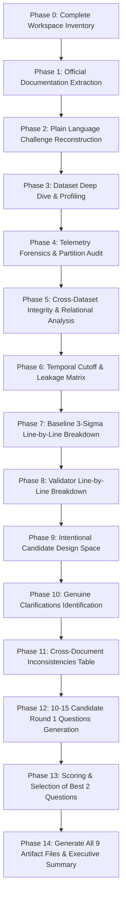

# Forensic Analysis & Challenge Audit: LPDG Innovation Hub Selection Challenge 2026

This implementation plan outlines the rigorous, step-by-step forensic analysis of the complete LPDG Innovation Hub Selection Challenge 2026 package. The objective is to produce a definitive forensic audit of all materials, data files, temporal structures, baseline algorithms, validation rules, inconsistencies, and intentional design decisions, culminating in the selection of the two highest-value Round 1 clarification questions.

## User Review Required

> [!IMPORTANT]
> **Data Privacy & Local Execution Notice**: In strict accordance with LPDG challenge rules and user directives, all analysis will be executed purely locally in the workspace. No data will be exported, published, or transmitted.

> [!NOTE]
> **No Final Solution Building**: This phase focuses exclusively on deep forensic auditing, data discovery, temporal leakage mapping, and question formulation. No ML models will be trained or final domain code written at this stage.

---

## Step-by-Step Execution Plan

### Phase 0: Workspace Inventory
- Recursively crawl all directories under `m:\LPDGE`.
- Compute file sizes, MIME types, hash summaries, and categorize each file (Documentation, Script, Baseline, Validator, Raw Parquet Data, Sample CSV Data, Metadata CSV, Field Visit Logs, Meter Reads, Engineer Reviews).
- Output: `complete_inventory.json`.

### Phase 1: Official Documentation Analysis
- Parse and analyze `README.txt`, `01-Challenge-Brief.pdf`, `02-Data-Dictionary.pdf`, `baseline_3sigma.py`, `validate_submission.py`.
- Extract requirements across Part 1 (Universal Core) and Part 2 (6 Tracks: Data Engineering, Software Development, DevOps, Data Science, Machine Learning, MLOps).
- Compile comprehensive requirement mapping table with exact citations and verification status (`CONFIRMED BY LPDG`, `AMBIGUOUS / NEEDS CLARIFICATION`).

### Phase 2: Plain Language Challenge Reconstruction
- Construct plain-language answers to all 15 challenge core questions:
  1. What LPDG operates (utility smart metering radio network).
  2. What a gateway is (LoRa / cellular concentrator).
  3. What happens when a gateway fails (silent data loss).
  4. Why failure matters (unbilled consumption, manual reads, customer dissatisfaction).
  5. Why only 15 visits per week (fixed operational field capacity).
  6. What our system produces (weekly 15 ranked gateway predictions + actionable reasons).
  7. For which weeks (8 consecutive Mondays: 2026-02-02 to 2026-03-23).
  8. Meaning of prediction rows (`week_start`, `rank`, `gateway_id`, `score`, `reason`).
  9. What Part 1 is (execution contract & submission hygiene).
  10. What Part 2 is (deep vertical specialization).
  11. Why depth > breadth (one excellent track beats two shallow tracks).
  12. Track-by-track expectations.
  13. Marking scheme (Pass/Fail gate, 60% Track, 25% Judgement, 15% Communication).
  14. Impact of Part 1 failure (automatic disqualification).
  15. Live session format (35 min: run unseen month, make live change, justify next steps).

### Phase 3: Actual Data Profiling & Statistical Audit
- Execute non-destructive Python scripts to profile:
  - `gateway_master.csv` (332 rows, asset metadata)
  - `field_visits.csv` (642 rows, historical work orders)
  - `meter_read_success.csv` (7,226 rows, weekly meter reading aggregates)
  - `engineer_review_2026-02.xlsx` (120 rows, expert labels from 2026-02-15)
  - `telemetry_sample_2025-08.csv` (181,484 rows)
- Record exact row counts, column types, null percentages, unique gateway IDs, ID formatting variants (bare hex vs colon-delimited), value ranges, and anomaly distributions.

### Phase 4: Telemetry Deep Forensics & Partition Audit
- Audit all 8 Parquet partitions (`month=2025-08` through `month=2026-03`):
  - Row counts, unique gateway counts per month, gateway churn/appearance over time.
  - Hourly completeness (24 hours/day checks, gaps, duplicated timestamps).
  - Timezone behavior (UTC `ts_utc` vs local `DateDt`/`hour` Europe/Berlin, DST transitions in Oct 2025 and Mar 2026).
  - Feature group distributions: Network (`rx_nr_pkts`, `rx_crc_bad`, `tx_*`), System (`avg_idletime`, `avg_load1`, `load1_bigger*`, `avg_memfree`, `avg_uptime`), Reboots (`reboot_cnt`, `reboot_duration_sec`, `r_cnt_*`, `r_dur_*`, `reboot_importance`), Connectivity (`disconnection_cnt`, `offline_duration_sec`, `online_duration_mins`, `no_conn_importance`), Cellular Technologies (2G/3G/4G), Operators (A1, O2DE, TelekomDE, etc.), Signal Quality (RSSI, RSCP/RSRP, EcIo/RSRQ bands).

### Phase 5: Cross-Dataset Integrity & Relational Analysis
- Gateway entity reconciliation across all 5 sources (`gateway_master`, telemetry, `meter_read_success`, `field_visits`, `engineer_review_2026-02`).
- Identify decommissioned vs newly installed gateways.
- Map field visit outcomes and replacement parts against telemetry degradation patterns.
- Correlate meter read failure percentages with radio/connectivity telemetry.
- Evaluate the nature of `engineer_review_2026-02.xlsx` (single timestamp snapshot: 2026-02-15).

### Phase 6: Temporal Cutoff & Leakage Risk Matrix
- Formulate the exact temporal horizon for all 8 scoring Mondays (`2026-02-02` to `2026-03-23`).
- Map what data is strictly historical vs future for each Monday:
  - Telemetry partitions (`month=2026-02` and `month=2026-03` contain data AFTER several decision dates).
  - `meter_read_success.csv` weekly reporting boundaries.
  - `field_visits.csv` (`requested_on` vs `visited_on` vs `outcome`).
  - `engineer_review_2026-02.xlsx` (created on 2026-02-15; valid only after week 3).
- Flag strict leakage boundaries for realistic simulation.

### Phase 7: Baseline Analysis (`baseline_3sigma.py`)
- Line-by-line audit:
  - Data ingestion, metric subset (`offline_duration_sec`, `disconnection_cnt`, `reboot_cnt`).
  - Trailing 28-day baseline window vs trailing 7-day evaluation window.
  - Calculation of mean and std (handling zero std with NaN).
  - 3-sigma flag logic, tie-breaking behavior, and fallbacks.
  - Explicit limitations and unhandled failure modes.

### Phase 8: Validator Analysis (`validate_submission.py`)
- Line-by-line audit:
  - Exact structural constraints (5 columns, 120 rows, 15 ranks per week, 8 specific Mondays).
  - Gateway ID normalization regexes (12-char bare hex vs 17-char colon hex).
  - Score numeric requirements and Reason char limit (≤ 300 characters).
  - Critical distinction: What the validator checks (schema/format) vs what it ignores (ranking quality, domain logic, leakage, score calibration).

### Phase 9: Intentional Design Questions (Candidate Ownership)
- Catalog all decisions explicitly delegated to candidates:
  - Definition of "needs a visit".
  - Decision threshold and false alarm trade-offs (€380 wasted visit vs €600/week unaddressed failure).
  - Feature selection and metric weighting.
  - Modeling paradigm vs heuristic rules.

### Phase 10: Genuine Clarifications for LPDG
- Filter for true ambiguities affecting evaluation, data contracts, and operational simulation.

### Phase 11: Cross-Document Inconsistencies Table
- Tabulate contradictions/discrepancies between Brief, Data Dictionary, README, Baseline, and Validator (e.g., date formats, gateway counts, scoring cost formulas).

### Phase 12: Candidate Question Pool (10–15 Questions)
- Formulate 10–15 candidate Round 1 clarification questions with rationale, documentation evidence, and priority ratings.

### Phase 13: Multi-Factor Scoring & Selection of Best 2 Questions
- Apply weighted rubric:
  - Importance to Correctness (40%)
  - Impact on Evaluation Fairness (25%)
  - Ambiguity in Official Materials (20%)
  - Likelihood of Concrete Answer (15%)
- Deliver final structured question cards.

### Phase 14: Report Generation & Executive Briefing
- Author all 9 required files:
  1. `challenge_understanding.md`
  2. `data_audit.md`
  3. `temporal_leakage_analysis.md`
  4. `baseline_analysis.md`
  5. `validator_analysis.md`
  6. `documentation_inconsistencies.md`
  7. `round1_question_candidates.md`
  8. `final_round1_questions.md`
  9. `complete_inventory.json`
- Deliver the final executive response with "WHAT I NOW KNOW ABOUT THE CHALLENGE" and "THE TWO QUESTIONS I SHOULD SUBMIT".

---

## Verification Plan

### Automated Checks
- Run inventory generator script to verify all files are indexed.
- Run Python profiling scripts to verify row counts, column counts, missing values, duplicates, and ID formats across all files.
- Run baseline script and validator script to verify expected behavior on the local dataset.
- Validate generated report files for completeness against all prompt requirements.

### Manual Verification
- Review generated markdown reports against all requirements in Phases 0-14 to ensure zero gaps and complete forensic accuracy.
