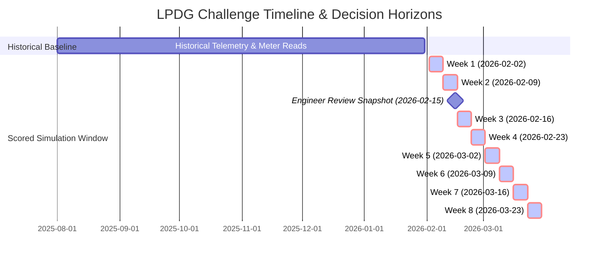

# Cross-Dataset Integrity & Temporal Leakage Analysis
**LPDG Innovation Hub Selection Challenge 2026**  
*Relational Reconciliation, Temporal Cutoffs, and Information Boundary Forensics*

---

## Section 1: Cross-Dataset Relational Integrity (Phase 5)

### 1. Entity Reconciliation Matrix

| Source Dataset | Gateway ID Representation in File | Unique Raw IDs | Normalized ID Count (12 Hex) | Overlap with `gateway_master` | Notes & Inconsistencies |
|---|---|---|---|---|---|
| `gateway_master.csv` | `02:14:06:F5:63:96` (Colon hex) | 332 | 332 | 332 / 332 (100%) | Complete master asset registry. |
| `telemetry` (Parquet) | `02:14:06:F5:63:96` (Colon hex) | 321 | 321 | 321 / 332 (96.7%) | 11 gateways in master never appear in telemetry (future installs). |
| `meter_read_success.csv` | `02:14:06:F5:63:96` (Colon hex) | 280 | 280 | 280 / 332 (84.3%) | Contains only the initial cohort of 280 active gateways up to Jan 2026. |
| `field_visits.csv` | `02:14:06:F5:63:96` (Colon hex) | 215 | 215 | 215 / 332 (64.8%) | 215 distinct gateways visited across 642 work orders. |
| `engineer_review_2026-02.xlsx` | `02:14:06:F5:63:96` (Colon hex) | 120 | 120 | 120 / 332 (36.1%) | Targeted sample of 120 gateways evaluated by M. Hoffmann. |

### 2. Identifier Normalization Forensics
- All raw CSV and Parquet files in the dataset use **17-character colon-separated uppercase hex strings** (e.g. `02:14:06:F5:63:96`).
- However, `baseline_3sigma.py` strips colons and outputs **12-character bare hex strings** (e.g. `021406F56396`).
- `validate_submission.py` explicitly normalizes both formats via regex:
  ```python
  _BARE = re.compile(r"^[0-9A-Fa-f]{12}$")
  _COLON = re.compile(r"^([0-9A-Fa-f]{2}:){5}[0-9A-Fa-f]{2}$")
  ```
- **Finding**: Candidates may output either colon-delimited or bare hex in `predictions.csv`; the official grading script normalizes both seamlessly.

### 3. Decommissioned & Newly Installed Gateways
- **12 Decommissioned Gateways**:
  - `gateway_master.csv` records 12 gateways decommissioned between `2025-09-22` and `2026-02-25`.
  - **Forensic Verification**: Telemetry records for all 12 decommissioned units cease exactly on or before their respective `decommissioned_on` date (0 telemetry rows exist after decommissioning).
- **Future Installed Gateways**:
  - 39 gateways have `installed_on > 2025-08-01`.
  - 11 gateways have `installed_on` dates in May–July 2026 (e.g., `06:C6:62:18:0A:40` installed on `2026-06-26`). These 11 gateways have zero telemetry rows and must never be recommended for field visits before their commissioning date!

---

## Section 2: Temporal Boundary & Cutoff Forensics (Phase 6)

The challenge requires weekly ranked dispatch decisions for **8 consecutive Mondays**:



### Exact Cutoff Table per Scoring Monday

| Scoring Week | Decision Monday Date | Legitimate Telemetry Horizon (`ts_utc`) | Legitimate `meter_read_success` Horizon | Legitimate `field_visits` Horizon | Legitimate `engineer_review` Horizon |
|---|---|---|---|---|---|
| **Week 1** | `2026-02-02` | `ts_utc < 2026-02-02 00:00:00Z` (1,073,239 rows) | `week_start <= 2026-01-26` (7,226 rows) | `requested_on < 2026-02-02` (642 work orders) | **ILLEGAL / UNAVAILABLE** (Review occurred on 2026-02-15) |
| **Week 2** | `2026-02-09` | `ts_utc < 2026-02-09 00:00:00Z` (1,115,327 rows) | `week_start <= 2026-01-26` (7,226 rows) | `requested_on < 2026-02-09` (642 work orders) | **ILLEGAL / UNAVAILABLE** (Review occurred on 2026-02-15) |
| **Week 3** | `2026-02-16` | `ts_utc < 2026-02-16 00:00:00Z` (1,157,681 rows) | `week_start <= 2026-01-26` (7,226 rows) | `requested_on < 2026-02-16` (642 work orders) | Available as of `2026-02-15` (120 rows) |
| **Week 4** | `2026-02-23` | `ts_utc < 2026-02-23 00:00:00Z` (1,200,388 rows) | `week_start <= 2026-01-26` (7,226 rows) | `requested_on < 2026-02-23` (642 work orders) | Available as of `2026-02-15` (120 rows) |
| **Week 5** | `2026-03-02` | `ts_utc < 2026-03-02 00:00:00Z` (1,243,524 rows) | `week_start <= 2026-01-26` (7,226 rows) | `requested_on < 2026-03-02` (642 work orders) | Available as of `2026-02-15` (120 rows) |
| **Week 6** | `2026-03-09` | `ts_utc < 2026-03-09 00:00:00Z` (1,286,953 rows) | `week_start <= 2026-01-26` (7,226 rows) | `requested_on < 2026-03-09` (642 work orders) | Available as of `2026-02-15` (120 rows) |
| **Week 7** | `2026-03-16` | `ts_utc < 2026-03-16 00:00:00Z` (1,331,254 rows) | `week_start <= 2026-01-26` (7,226 rows) | `requested_on < 2026-03-16` (642 work orders) | Available as of `2026-02-15` (120 rows) |
| **Week 8** | `2026-03-23` | `ts_utc < 2026-03-23 00:00:00Z` (1,375,881 rows) | `week_start <= 2026-01-26` (7,226 rows) | `requested_on < 2026-03-23` (642 work orders) | Available as of `2026-02-15` (120 rows) |

---

## Section 3: Critical Temporal Leakage Hazards

### Leakage Risk 1: Forward-Looking Telemetry
- **Risk**: The workspace includes `month=2026-02` and `month=2026-03` telemetry spanning all the way to `2026-03-31 23:00:00Z`.
- **Hazard**: If a model computes global aggregates (e.g., full-period standard deviation or future disconnection counts) across February or March 2026 when generating predictions for `2026-02-02`, it commits severe temporal leakage.
- **Enforcement**: Like `baseline_3sigma.py` (`frame["ts"] < end`), every feature pipeline must apply a strict temporal filter `ts_utc < monday_start_utc`.

### Leakage Risk 2: `engineer_review_2026-02.xlsx` as a Static Label
- **Risk**: The Excel file provides 120 labels (`60 Normal`, `60 Schlecht`) evaluated on `2026-02-15`.
- **Hazard**: Using these labels as a fixed training target for predictions generated on `2026-02-02` and `2026-02-09` violates causality, because that evaluation did not exist in the operational system until mid-February.
- **Ambiguity**: LPDG does not specify whether this file is intended as an offline validation benchmark, an operational signal received during Week 3, or ground truth for the live session.

### Leakage Risk 3: Field Visit Post-Event Information
- **Risk**: `field_visits.csv` records `requested_on`, `visited_on`, `outcome`, `parts_replaced`, and `technician_hours`.
- **Hazard**: When a work order is requested on day $T$, the `outcome` and `parts_replaced` are only known on day $T + \Delta$ after the technician physically visits.
- **Enforcement**: Historical visit outcomes can only be used as features for dates strictly after `visited_on`.

### Leakage Risk 4: Meter Reading Lag
- **Risk**: Smart meter reading systems aggregate billing batches over weekly cycles.
- **Observation**: `meter_read_success.csv` ends abruptly on `2026-01-26`. The absence of February/March records confirms that real-time dispatch decisions must rely primarily on telemetry rather than contemporary meter read success.
