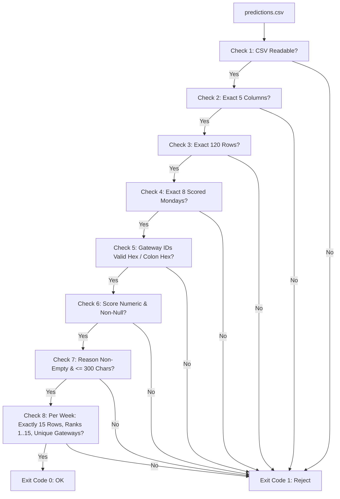

# Line-by-Line Schema & Contract Audit: `validate_submission.py`
**LPDG Innovation Hub Selection Challenge 2026**  
*Validation Assertions, Structural Constraints, and Grader Mechanics*

---

## Section 1: Validation Rules & Schema Enforcement (Phase 8)

`validate_submission.py` acts as the gatekeeper script used by LPDG's automated grading system.

### Exhaustive Inspection of Validation Rules

| Check # | Code Reference | Validation Logic | Enforcement Detail | Failure Behavior |
|---|---|---|---|---|
| **1. File Readability** | Lines 44–47 | `pd.read_csv(path)` | Verifies the file exists and is valid CSV format. | Returns `could not read <path> as CSV` and halts. |
| **2. Column Contract** | Lines 49–55 | `REQUIRED_COLUMNS = ["week_start", "rank", "gateway_id", "score", "reason"]` | Asserts exact column set. No missing columns, no extraneous columns allowed. | Lists missing/extra columns and halts. |
| **3. Exact Row Count** | Lines 58–63 | `len(frame) == 120` | Must equal $15 \text{ visits} \times 8 \text{ weeks} = 120$ rows. | Appends error if count $\ne 120$. |
| **4. Scored Mondays** | Lines 66–79 | `found == SCORED_WEEKS` | Must contain all 8 specified Monday dates (`2026-02-02` through `2026-03-23`) formatted as `YYYY-MM-DD`. | Flags unexpected or missing dates. |
| **5. Gateway ID Format** | Lines 28–39, 80–85 | Regex `^[0-9A-Fa-f]{12}$` OR `^([0-9A-Fa-f]{2}:){5}[0-9A-Fa-f]{2}$` | Accepts either 12-char bare hex or 17-char colon-delimited hex. | Flags any invalid ID strings. |
| **6. Score Validity** | Lines 87–90 | `is_numeric_dtype` and `notna().all()` | `score` column must be float/integer, with zero null/blank values. Any numeric scale is accepted. | Flags non-numeric or missing scores. |
| **7. Reason Constraints** | Lines 92–97 | `len(reason) <= 300` and non-empty | `reason` string must be non-empty and strictly $\le 300$ characters. | Flags empty or oversized reason strings. |
| **8. Per-Week Ranks & Uniqueness** | Lines 99–109 | Group by week: `ranks == 1..15`, `unique(ids) == 15` | Within each of the 8 weeks: exactly 15 rows; ranks must be exact permutation of $1, 2, \dots, 15$; no duplicate gateway within the same week. | Flags rank gaps/repeats or duplicate gateways. |

---

## Section 2: Critical Distinction: Format Validation vs Evaluation Quality

> [!IMPORTANT]
> Passing `validate_submission.py` guarantees only that the file is **syntactically readable** by LPDG's evaluation pipeline. It does **NOT** assess solution quality, predictive accuracy, economic optimality, or causal integrity.

### What the Validator DOES NOT Check:

1. **Ranking Quality & Operational Cost**:
   - The validator has no knowledge of which gateways actually failed.
   - A random permutation of valid gateway IDs with placeholder scores will pass the validator with exit code 0.
2. **Temporal Leakage**:
   - The validator does not verify whether predictions used future data.
3. **Cross-Week Realism**:
   - A gateway may appear in all 8 weeks or in only 1 week; the validator imposes no cross-week dispatch constraints.
4. **Reason Semantics**:
   - The validator checks only string length ($\le 300$ chars). It does not verify grammatical clarity, diagnostic validity, or relevance to the operations manager.
5. **Gateway Active / Decommissioned Status**:
   - The validator accepts any syntactically valid hex ID, even if that gateway was decommissioned months earlier.
